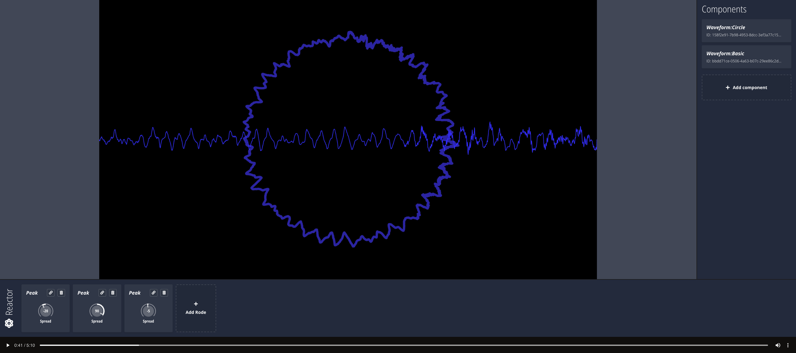
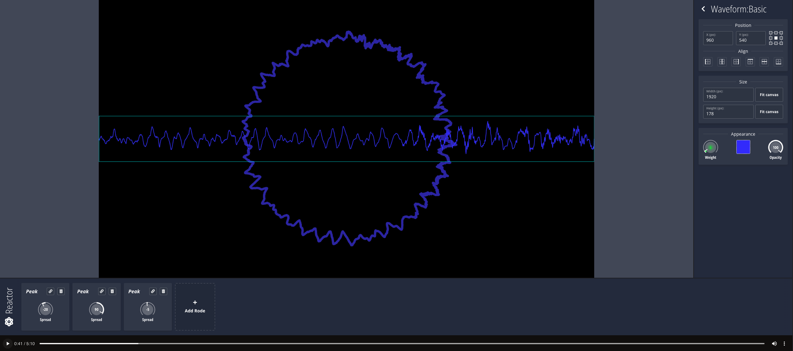
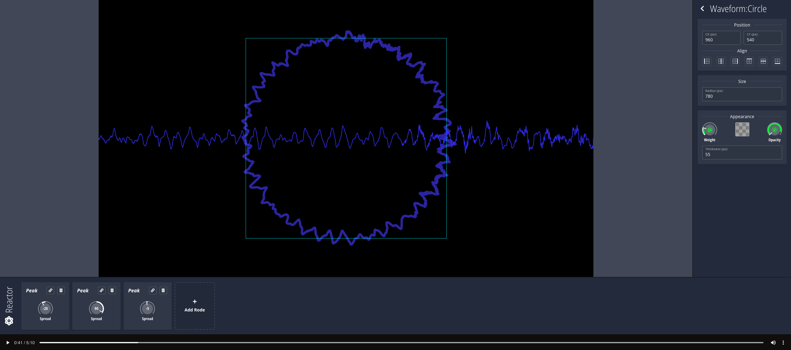

# Visaud

Strange name, simple target: create visualizer videos for audio tracks completely on client-side. Completely free. Forever.

## Status

:hammer: Active (somehow) development

## TODO list

### Waveform
Set of lines that represents a waveform for specific moment of the audio track

#### Straight
Set of lines drawn in a straight line from the left to the right

##### Basic
- [x] Basic render
- [x] Size settings
- [x] Positioning on the scene

##### Mid-tier
- [x] Color customization
- [x] Opacity customization
- [x] Weight customization

##### Advanced
- [ ] Stroke style customization
- [ ] Gradiental fill
- [ ] Basic transformations

#### Circular
Set of lines drawn in a circular shape anti-clockwise

##### Basic
- [x] Basic render
- [x] Size settings
- [x] Positioning on the scene

##### Mid-tier
- [x] Color customization
- [x] Opacity customization
- [x] Weight customization
- [x] Thickness customization

##### Advanced
- [ ] Stroke style customization
- [ ] Gradiental fill
- [ ] Basic transformations

---

### Frequency bars
Set of vertical lines representing loudness of specific frequency for a specific moment of the audio track

#### Straight
Bars drawn in a straight line from the left to the right

##### Basic
- [x] Basic render
- [ ] Size settings
- [ ] Positioning on the scene
- [ ] Direction settings

##### Mid-tier
- [ ] Color customization
- [ ] Opacity customization
- [ ] Bar style customization
- [ ] Band-pass control

##### Advanced
- [ ] Gradiental fill
- [ ] Basic transformations
- [ ] Independent bar color and opacity based on frequency loudness level
- [ ] Bar FXs (e. g. )
- [ ] Alternative style (zig-zag)

#### Circular
Bars drawn in a circular shape anti-clockwise

##### Basic
- [ ] Basic render
- [ ] Size settings
- [ ] Positioning on the scene
- [ ] Direction settings

##### Mid-tier
- [ ] Color customization
- [ ] Opacity customization
- [ ] Bar style customization
- [ ] Band-pass control

##### Advanced
- [ ] Gradiental fill
- [ ] Basic transformations
- [ ] Independent bar color and opacity based on frequency loudness level
- [ ] Bar FXs (e. g. gravity caps)
- [ ] Alternative style (zig-zag)

---

### Other FX components
Such components like scene background colors/gradients, images placement, particle-based components, etc. are now under consideration (until basic stuff will be done)

---

### Reactor
Concept of making parameters of visual components to depend on specific audio track parameters / timeline automation.

#### Rodes
Each component of Reactor is called Rode. The name might seem stupid, but it has meaning, I promise :skull:  
There are rods in nuclear reactor, and that "e" at the end of "Rode" is used to tribute the RØDE brand, because I like their products.

##### Peak
Makes parameters react to the loudness level of the audio track.
- [x] Spread control
- [ ] Min/max loudness control
- [ ] Curvature

##### Freq
Makes parameters react to the most loud frequency level at the specific frequency range of the audio track.
- [ ] Spread control
- [ ] Band-pass control
- [ ] Curvature

##### Timeline
Makes parameters react to the specified automation through the audio track timeline
- [ ] Timeline manager
- [ ] Min/max value control

---

### Other important stuff
The visual is all good, but it does not matter if you cannot reuse your created masterpiece
- [ ] Save composition as a video
- [ ] Save scene setup

And some other utility stuff
- [ ] Components reorder
- [ ] Components / Rodes copying

## Does it really work?
Thats what it looks like

04.06.2024:  




## Launch locally?
For sure.  

NodeJS: v20.10.0  
NPM: 10.5.2  

Clone repo, then:
```bash
npm install # install deps
npm run dev # and open http://localhost:7154
```

Choose the audio and give it a try!

## Contributing

Not needed for now, just chilling and developing for fun. Hope, you are not waiting for this ~~pet project~~ product to be released soon :skull: